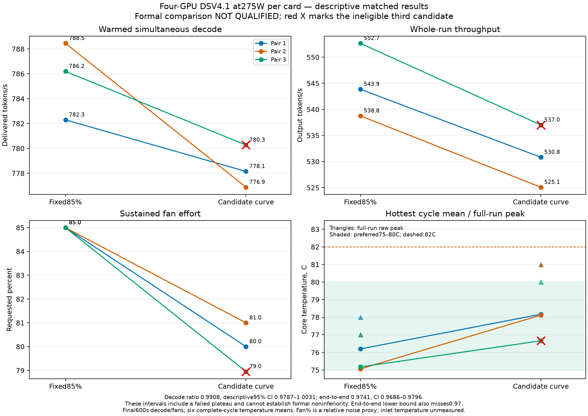

# Four-GPU uniform cooling with native DeepSeek V4.1 Flash

Status: owner-accepted practical operating profile, installed with boot persistence. Formal noninferiority was not established. The owner ended further qualification and explicitly waived the two-hour soak; omitted tests are recorded below.

For daily use, run DSV and leave cooling to the installed services. No manual fan setting or repeated tuning is required. Both cooling services have boot startup, six-second watchdogs and automatic two-second restart supervision without restart-limit lockout. Keep the275W caps and uniform controller active while optimizing DSV. [Everyday-use instructions](OPERATIONS.md#everyday-dsv-use) are the operating reference; further fan qualification is not part of routine model testing.

The practical objective is the quietest measured uniform eight-fan profile that preserves useful native decode performance while keeping the hottest core normally at or below82 C. The owner's preferred sustained band is75–80 C. Cooler idle operation does not need artificial heating. Fan percentage is the agreed direct relative noise proxy; no dBA or instrumented inlet temperature claim is made.

The earlier two-card no-gap study showed that neighboring-card fans materially change cooling even when the neighbor is idle. It also distinguished a nominal power cap from actual consumed power and explicitly held broader spacing/extrapolation claims. The new study follows that method: retain exact identities, caps, fan commands/readbacks, temperature trends, real inference timing, failed runs and source versions. SMBIOS type9 slot designations/BDFs, the motherboard manual and the owner's original-card endpoints establish the current top-to-bottom indices as3/0/2/1. Fresh PCI addresses agree with those recorded firmware slots. Gap/riser dimensions remain unmeasured. The controller uses the hottest valid UUID rather than assuming a particular slot must always be hottest.

The four-card native automatic-fan baseline reached90 C after259.80 seconds, with the hottest card's fans around54%. Its final180-second slope was still about7.63 C/min. This establishes a cooling problem for that recorded workload and stack. It does not establish that every workload or room condition will do the same. Verified automatic control remains useful for short recovery handoffs, with bounded inference continuity.

Three descriptive20-minute C8 exact8192-input/2048-output screens preceded nearby candidates. Fixed85% passed thermal screening with hottest mean75.08 C/peak77 C; final600 simultaneous decode807.47 tokens/s and whole-run end-to-end555.91. Protected fixed80% had hottest mean78.29 C/peak82 C and final600 decode779.98, but briefly needed83%, so it was not qualified as a flat80% profile. The initial temperature curve passed with hottest mean78.34 C/peak81 C, steady fan effort79.55%, final600 decode799.72 and end-to-end554.01. These are descriptive screens with different run order/warmup, not a causal or statistically qualified performance comparison.

The original20-minute comparison stopped after its third reference failed the closing thermal-slope gate; one prospectively declared repeat also failed narrowly. Both retain their original labels. The new comparison uses six entirely new30-minute runs and a prospective thermal plateau measured over six complete workload cycles. Raw peaks, exact275 W caps, thermal counters and uniform readbacks remain hard constraints. It neither relabels earlier runs nor reuses earlier pairs in the new confidence interval.

The first completed30-minute lower2 pair reduced final600 fan effort from85% to79.25% and held a raw81 C peak, with no thermal-counter increment. Warm decode was780.60 versus787.63 tokens/s (about0.89% lower), but whole-run throughput was528.43 versus550.43 (about4.00% lower). Its hottest-card six-cycle slope was+0.374 C/min, exceeding the prospective0.3 limit even though raw180 screening passed. It was not qualified. The scheduler terminated before starting a second pair, retaining all original analyses and a stop receipt. One pair below0.97 already prevents the declared three-pair95% interval from qualifying; it does not establish population inferiority from one replication.

The recorded timing decomposition shows similar post-delivery intervals (whole-run means0.846 versus0.862 seconds) and DSpark acceptance lengths (4.722 versus4.720). The last ten minutes' mean wave duration differed by about0.99%, compared with a larger difference earlier. Those are descriptive observations, not proof of a thermal cause. A separate new six-run series is now testing the original curve with its80%/30-second startup; both configuration components are assessed together with the same source, runtime, temperature, noise and performance gates.

Base80 results are retained below in actual run order. Both raw and complete-cycle thermal checks passed in the first four phases. The third reference completed generation but failed both thermal-stability checks, terminating the wrapper before a third candidate. All requested/enforced cap ranges were exactly275 W, with no thermal-counter increases. The series does not establish the final three-pair confidence gates.

| Phase suffix | Requests | Elapsed seconds | Final600 decode tokens/s | Simultaneous coverage seconds | Whole-run tokens/s | Final600 fan % | Raw peak C |
|---|---:|---:|---:|---:|---:|---:|---:|
| p1-ref85 |480|1807.544|782.295|392.751|543.854|85|78|
| p1-candidate |472|1820.966|778.149|389.618|530.819|80|81|
| p2-candidate |464|1809.679|776.879|390.041|525.079|81|81|
| p2-ref85 |480|1824.211|788.451|393.767|538.760|85|77|
| p3-ref85 (unsteady) |496|1829.038|793.328|396.608|555.270|85|76|
| r2-p3-ref85 |488|1808.059|786.196|393.643|552.657|85|77|
| r2-p3-candidate (unsteady) |472|1800.003|780.273|390.000|537.002|78.951|80|

All suffixes refer to `v2-matched-cycle30-base80`. The first pair's candidate/reference ratios were0.994701 for decode and0.976032 for end-to-end; the second's were0.985324 and0.974607. The identical candidate configuration need not settle at exactly80% in every run. The unrounded compact analyses, coverage intervals and retained sources are authoritative. These are paired point estimates, not final confidence limits.

The third reference's middle cards cooled at complete-cycle slopes-0.380111 and-0.373343 C/min, outside the declared absolute0.3 limit. This was a real complete-cycle cooling trend, not solely a raw-window boundary artifact. Its hottest-card mean was74.222 C and peak76 C; the failure was comparative thermal steadiness rather than overheating. Its original labels, telemetry and terminal wrapper receipt are retained. A prospectively declared replacement or an explicitly limited two-pair performance claim must be distinguished from a completed three-pair qualification.

One bounded replacement of the entire third pair completed under `v2-matched-cycle30-base80-r2`. The specification was saved before either new measurement, retained the two eligible pairs from the same parent study, and changed no gate or executable measurement/control source. The failed original reference remains part of the evidence. The final candidate also failed plateau eligibility, so the amended comparison is not qualified. No further repetition occurs under this amendment.

The replacement reference passed both thermal checks, with maximum absolute complete-cycle trend0.035705 C/min, top raw180 mean75.144444 C and raw peak77 C. The candidate completed472 requests with780.27 tokens/s final600 decode,78.95% fans and80 C raw peak. Its top-card complete-cycle cooling slope was-0.330240 C/min, exceeding the absolute0.3 limit; this is comparative steadiness failure, not overheating. Both original raw and cycle labels remain not-qualified. Caps remained exactly275 W and thermal counters unchanged.

Across the three completed pairs, descriptive geometric mean decode ratio was0.990822 (two-sided95% interval0.978716–1.003077); end-to-end ratio0.974102 (0.968594–0.979642). The latter interval includes more than the allowed3% loss. These intervals include an ineligible thirdcandidate and cannot establish the formal noninferiority claim even where a numerical bound passes. Two eligible pairs are insufficient for the predeclared three-pair test. A separate, exact-byte-reviewed selection receipt selects the unchanged curve for independent operational validation with this uncertainty; it does not fabricate a qualified comparison or global optimum.

The new comparison's final600 noise and decode windows begin after at least twenty minutes of warmup. Decode measures delivered token increments only during simultaneous post-first-token/pre-drain intervals and retains the actual coverage duration. End-to-end rate includes prefill and request completion. Both metrics must independently establish a paired95% interval lower bound of at least97% of the fixed85% reference. TTFT, latency, clocks, power-limit/thermal event counters, DSpark acceptance, host memory, swap and process-specific paging accompany the rates. A slower wave alone is not evidence of thermal throttling. See `DECODE.md` for the measurement contract and comparison limitations.

Power-limit requests and enforced limits were275 W on every matched-comparison sample. Short reported power samples can exceed that setting: the initial screens included readings around291–293 W. The study therefore claims configured/enforced limits, not an instantaneous electrical ceiling. Normal recorded clocks-event masks were0 or4, with no thermal-violation counter increase; software power limiting is distinct from thermal limiting. Sampling cannot exclude every event between observations.

The256 GB DDR5 host supports the tested RAM-offload adaptation of the published native four-card recipe. The checkpoint comprises88 fully verified files totaling510,313,345,146 bytes. The model revision and exact image ID are pinned. Global locked memory was about188.17 GiB and the model's proportional resident allocation about203.42 GiB, with around31 GiB available in the fresh snapshot. Per-worker lock counters include shared mappings and must not be multiplied by four. Existing swap and asynchronous accounting prevent a byte-exact claim about every Engram page or every future context length.

The repaired controller passes46 CPU cases. Real idle primary/observer STOP and KILL tests restored automatic policies in0.54–5.82 seconds and custom readiness in3.52–14.87. An actual validated exact-cgroup pause succeeded with Docker RPC deliberately unavailable, and a persistent invalid profile triggered the production nonrenewable deadline. Those proofs retain installed hashes. Earlier loaded-fault results belong to earlier versions. The final byte-identical installation verified all eight automatic policies,275W caps and the same permanent lease before returning to fresh custom readiness; all three owned units are enabled for boot. Current-source hot faults, the full20-minute C1 test,65k prefill, two final-profile bursts and a real host reboot were not completed after the owner ended extra qualification. The partial C1 trace is retained as owner-interrupted, not failed hardware. The two-hour soak was explicitly waived.

The65%/15-second startup setting passed a loaded-idle burst:35%/44 C before load,65% peak fan command,50 C peak core, and return to34% in58.47 seconds. An earlier helper's exact30% idle requirement failed before any GPU burst; that procedural failure remains archived. The resident runtime can reasonably settle above30%, so the corrected criterion uses actual stable cool idle rather than a preconceived value.

The practical recommendation is the original temperature curve with80%/30-second startup: its completed matched candidates used about79–81% sustained fans and peaked at80–81C, and the owner accepted the achieved cooling/noise behavior. Lower-effort neighbors did not establish a better thermal/performance tradeoff. This is an evidence-backed operating choice, not a proved global noise minimum or formally qualified3% performance guarantee. Physical fan-stall immunity, full advertised-context qualification and infallible software are not established.

The final native runtime cold-started successfully after replacement with bounded Docker/RAM logs. Direct authenticated and routed arithmetic requests returned correct JSON; the router's actual selected endpoint wasTower2 and the native ID `deepseek-v4.1-flash`. A trusted Pixel documentation-navigation turn also used this deployment, with authoritative per-call receipt import. Persistent Codex guidance and the reinstalled Dream Fleet Executor plugin now identify this native deployment and retain the90% useful fresh-token local-share target. Codex's account model remains the reviewer; this does not replace Codex's built-in model or guarantee a subscription-cost conversion.

Read [EVIDENCE.md](EVIDENCE.md) for compact receipts, full raw release assets, exact hashes and the provenance/qualification limits.

Read [ENGINEERING.md](ENGINEERING.md) for the observed problems, design decisions, retained failures and fixes. [ADAPTATION.md](ADAPTATION.md) maps the source files and the explicit hardware/workload/privilege contracts another user must review; the existing-host update bridge is not a portable fresh-host bootstrap.
